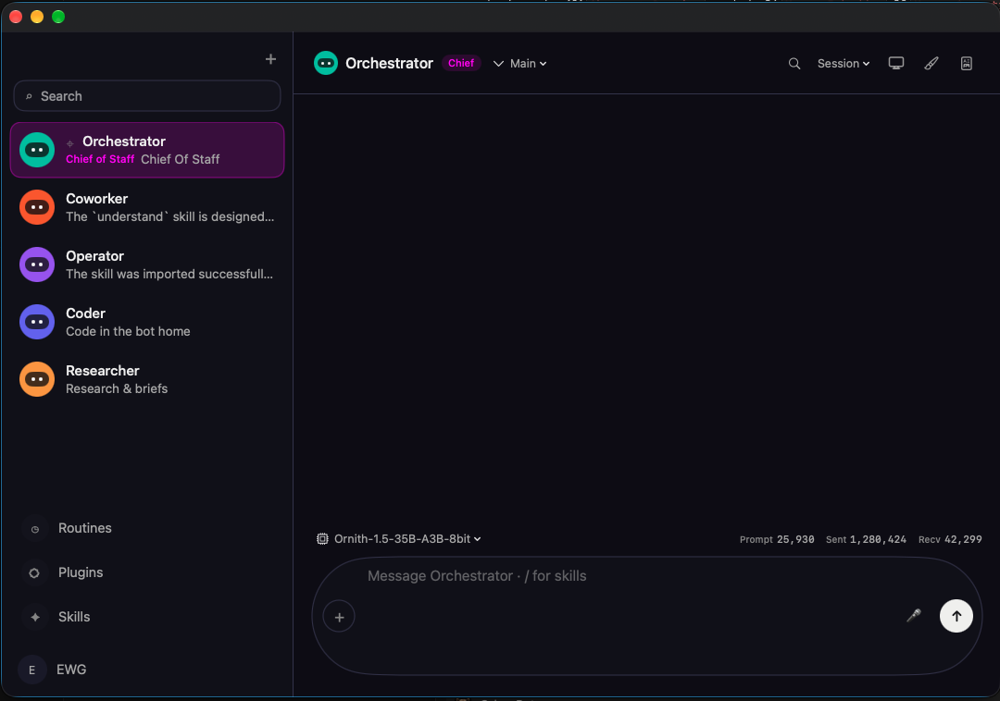
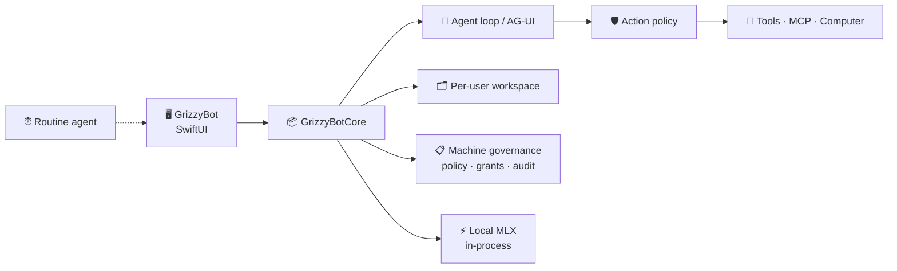

<p align="center">
  
</p>

<h1 align="center">GrizzyBot</h1>

<p align="center">
  <strong>A native macOS team of AI agents.</strong><br>
  Each bot has its own chat, files, memory, computer, routines, and tools — on this Mac.
</p>

<p align="center">
  
  
  
  
</p>

<p align="center">
  
  
  
  
</p>

<p align="center">
  <a href="#-whats-new">What's new</a> ·
  <a href="#-what-you-get">Product</a> ·
  <a href="#-chat">Chat</a> ·
  <a href="#-tools">Tools</a> ·
  <a href="#-artifacts">Artifacts</a> ·
  <a href="#-plugins-mcp--destinations">Plugins</a> ·
  <a href="#-computer">Computer</a> ·
  <a href="#-governance">Governance</a> ·
  <a href="#-models">Models</a> ·
  <a href="#-build">Build</a> ·
  <a href="#-license">License</a>
</p>

<br>

<p align="center">
  
</p>

<br>

---

> **Bring your own model.** Connect a cloud or local provider and every send runs a real tool-calling loop. Without a model, a scripted fallback still drives the UI so you can explore offline.
>
> **Requires** macOS 15+ · **Xcode 27** / Swift 6 · Version **0.7** (project format `xcode16_3` via XcodeGen)
>
> The version lives in `project.yml` (`MARKETING_VERSION` / `CURRENT_PROJECT_VERSION`) and nowhere else — the Info.plist expands the build settings, and `Scripts/make-app.sh` reads them out of that file. Bump it there and run `xcodegen generate`.

---

## 🆕 What's new

### Added

- **Artifacts.** Bots create documents, code, diagrams, SVG, HTML, and React apps that you keep, version, edit, and re-open — shared across every bot and mirrored to disk. Routines can create them unattended. See [Artifacts](#-artifacts).
- **Artifact panel** at ⇧⌘A or the chat-header icon: browse, step through versions, preview or read source, copy, export, delete, and create one by hand.
- **Syntax-highlighted editor** with line numbers for artifacts, covering Swift, JS/JSX/TS, Python, shell, CSS, JSON, HTML/SVG/XML, Markdown, and Mermaid. Saving appends a version, so restoring an old one is just editing it.
- **Local MLX.** On Apple Silicon, run MLX models **in-process** inside GrizzyBot (no API base URL): Rescan disk (Hugging Face cache / LM Studio / custom folders), optional Hugging Face search & download, pick **Runs in app** in Model Connect. See [Models](#-models).
- **Direct Google OAuth** with fixed loopback `http://127.0.0.1:8765` and a step-by-step Cloud Console guide in Settings → Connections.
- **The Google plugins now do what their descriptions promise.** Gmail **sends mail** (it never could, despite the tool advertising it), Calendar **creates and removes** events, Sheets **reads real cells and appends rows** (it was a stub), Docs **creates documents**, and Drive **uploads files**. See [Google / Gmail](#-google--gmail).

### Fixed

- **Google Calendar writes never reached Google.** `plugin_call` had no write path for `google-calendar`, so every event fell through to a fallback that returned a fabricated `wrote local` success without making a single API call. Reads worked the whole time, which made it look like a sync or scope problem. Events are now genuinely created and return a Google event link.
- **Google Calendar could not be read at all.** Every query went to Google's full-text `q=` parameter, so `primary` searched for the *word* primary and `2026-09-12` searched for that string in event titles — a healthy calendar always reported "No Calendar events", which is what sent a bot round in circles insisting the calendar was empty. Reads are now time windows, with dates, ranges, and `today` / `this week` understood, and a calendar named rather than identified is resolved against your calendar list.
- **Silent fake success for every other write-less plugin.** That same fallback reported success for Gmail, Drive, Docs, Jira, Asana and the rest. It now fails loudly and says nothing was sent.
- **`canvas_place_image` ignored the working folder**, unlike every other file tool, so an image a bot had just written came back as "No image to place."
- **The CI build had been broken since August** — every run failed at the first step on a compiler type-check timeout in `ContextCompactor.encodedSize`, so no test in the repo had actually run in CI. Rewritten as plain statements.
- **Overlay snapshot tests** compared an exact PNG hash, which cannot pass on any machine but the one that recorded it. Now a pixel comparison with a tolerance, plus the failing render saved for inspection.
- **Three flaky tests, each a real bug:** a data race in the parallel-tool test recorder (`@unchecked Sendable` with unsynchronised `append`), wall-clock `Task.sleep` waits left in `ProductSurfaceTests`, and parallel tests sharing the process-wide `FolderWatcherService` while it watched real directories. The suite now runs clean across repeated full runs.

---

## ✨ What you get

<table>
<tr>
<td width="33%" valign="top">

### 🗂️ Workspace
Local or named accounts. Separate files, chats, and secrets per user. Passwords are PBKDF2. Keys live in **Keychain**.

### 🤖 Bots
Templates for coworker, researcher, writer, coder, and operator. Per-bot model, tools, skills, home folder, and optional **Chief of Staff** (roster mark). Rooms, spawn, and short-lived subagents.

### 💬 Chat
Markdown, tool cards, live step progress. Per-bot model picker and token stats. Slash skills (`/research …`). Search, edit, regenerate, branch, undo. Files, images, dictation, spoken replies.

### 🧩 Artifacts
Documents, code, diagrams, and small React apps a bot builds and you keep. Versioned, shared across bots, mirrored to disk, editable in a syntax-highlighted editor. Rendered in a frame with **no network**.

</td>
<td width="33%" valign="top">

### 🖥️ Computer & canvas
This Mac preview or in-app browser. Resizable side panel (monitor icon). Screenshot → targets → click / type / key. Shared canvases. Exclusive takeover for login.

### 🛡️ Governance
CEL policy, MCP grant matrix, knowledge ACLs, published components, owner/operator roles, searchable audit with a boot boundary.

### 🔌 Connect
OpenRouter, OpenAI, Anthropic, Ollama / LM Studio / vMLX / oMLX / **Splash**, **Local MLX**, Composio plugins, direct Google OAuth, MCP / Toolport, AG-UI coworkers.

</td>
<td width="33%" valign="top">

### ⏰ Routines
Cron prompts while the app is open, plus signed Release background ticks via LaunchAgent.

### 🧠 Memory
Per-bot `MEMORY.md` plus account `SHARED.md`. Pins always load; secrets are refused.

### 🎨 Chrome
Themes, menu bar, launch at login, Session snapshots / iCloud backup, redacted export, artifacts panel.

</td>
</tr>
</table>

---

## 👤 Accounts and workspaces

- Continue with a local workspace on this Mac, or sign up with email.
- Each signed-in account is a separate workspace. Bots, chats, settings, and files do not mix.
- The **first account on the Mac is owner**. Later sign-ups are operators: they get their own bots and chats; policy, grants, knowledge, and published components are shared and owner-gated.

```text
~/Library/Application Support/GrizzyBot/
  users.json / session.json / governance.json / audit.json
  canvases/             shared boards (screenshots, strokes) for every bot on this Mac
  artifacts/            shared artifacts (every bot on this Mac)
  MLXModels/            Local MLX weights downloaded in-app from Hugging Face
  users/<userId>/
    workspace.json      main config: bots, MCP servers, tools, model, routines
    SHARED.md           memory every bot on this account can read
    homes/<botId>/      that bot’s private sandbox (MEMORY.md, PLAN.md, shell cwd)
    skills/             imported SKILL.md folders
    destinations/       destination_write log
```

The file you usually want is **`users/<userId>/workspace.json`**. API keys and OAuth tokens are **not** in that JSON — they live in Keychain (`com.grizzybot.app.secrets`). MCP command/args (including `fast-filesystem-mcp --allow` paths) are in `workspace.json` under `mcpServers`.

---

## 🤖 Bots

Create from a template or from scratch.

| | Template | For |
|:--:|---|---|
| 🤝 | **Coworker** | General work — files, search, memory, computer |
| 🔎 | **Researcher** | Web search, cited notes, saved briefs |
| ✍️ | **Writer** | Markdown reports, CSV tables, HTML slides |
| 💻 | **Coder** | Read, edit, and run code in the bot home |
| 🕹️ | **Operator** | Drive the in-app browser or this Mac |

Each bot has a **name**, **title**, description, instructions, enabled skills and tools, optional per-bot model, visibility (private / shared), runtime (GrizzyBot loop or **AG-UI** endpoint), a private **home** folder, and an optional **working folder**. Toggles cover auto-approve, speak replies, notifications, and **Chief of Staff** (roster badge / highlight; that bot cannot be hidden or deleted). Every bot's prompt lists the other bots on this Mac and their roles, and the Chief of Staff is additionally told it owns coordination across them — it still does **not** auto-delegate; it delegates only when it decides to call `message_bot`. Spawn child bots or a short-lived subagent from chat. Rooms group several bots in one conversation: **@mention** a member to route a message to it (`@everyone` for all), and a reply that @mentions another member pulls that member in — capped at six turns, with no bot speaking twice. Every `message_bot` handoff is logged with its reply and outcome on the **Bot Chat** page. Each bot gets one of six avatar shapes or an uploaded picture.

<details>
<summary><strong>📁 Home vs working folder</strong></summary>

<br>

Home is the sandbox (`users/<userId>/homes/<botId>/`): `MEMORY.md`, `PLAN.md`, and shell `~`. The profile **Working folder** is the project tree on this Mac. When it is set, relative `read_file` / `write_file` / `edit_file` / `move_file` / `delete_file` / `list_files` read and write that folder (empty `list_files` lists it). Absolute/`~` paths outside it still pause for approval. **Shell cwd stays the bot home**, but when a working folder is set the sandbox also allows writes there (so shell can `mv` / `rm` / `mkdir` in the project tree without changing cwd). MCP does **not** inherit the working folder — pass absolute paths (or add `--allow` on `fast-filesystem-mcp`).

</details>

---

## 💬 Chat

- Markdown replies, tool cards, component cards, and live “thinking… step *N*” while the agent runs.
- Search chats (⌘F), edit a send, regenerate, branch, undo send (⌘⇧Z).
- Attach files into the bot home (`inbox/`). Drop or paste an image (or put a filesystem path in the box) and vision models receive JPEG.
- Dictation, speak replies (ElevenLabs or macOS TTS), and a finish notification when a run completes.

### 📂 Sessions and tasks

Chat header **Session** menu (this thread only): export/import chat JSON, export a Markdown transcript, undo send, clear or delete the thread. Workspace-wide snapshots and iCloud backup live under Settings → General → **Session**.

**Main** / task picker: keep parallel task threads on the same bot (`Main thread`, existing tasks, **New task…**). Branching a message still forks history; tasks are named workstreams.

### ⌨️ Composer

The model menu sits on the **top-left** of the composer capsule. Token stats sit on the **same row, top-right**:

| | Label | Meaning |
|:--:|---|---|
| 📥 | **Prompt** (`P` when the right panel is open) | While you type: live estimate of this box (~4 characters per token, including dictation). After a reply: billed input of the **first** model call that turn (system + history + this message) — not the summed agent-loop total. |
| ⬆️ | **Sent** (`S`) | Billed input tokens for **this chat** (every run on this bot). |
| ⬇️ | **Recv** (`R`) | Billed output tokens for **this chat**. |

Hover the numbers for the same explanation. With the computer / settings panel open, labels compact to **P / S / R** and the composer placeholder shortens so the bar stays readable. Switching bots does not mix totals. Sidebar **Weekly usage** is still the last seven days across the workspace. Settings → General → **Token counters** zeros Prompt / Sent / Recv for the current bot (or every bot) without deleting chats.

### 🔁 Agent loop

When a model is connected, each send runs a tool-calling loop (up to 48 steps) with context compaction on long threads. Screenshots and composer images attach only when the model can actually see images. Empty web searches stop instead of retrying forever. Transient 429/5xx errors retry. MCP dead ends (no route, missing args, expired cursors, connection failures) get recovery hints and stop looping after a few strikes. Identical MCP calls in the same step are skipped. A **stall watchdog** (default 60s, configurable) ends a turn when the stream goes silent.

Without a model, scripted replies still create files, open the computer, and exercise the UI.

**AG-UI runtime.** Point a bot at a LangGraph, Mastra, CrewAI, or other AG-UI endpoint. GrizzyBot consumes the full event set (text, tool calls, state snapshot/delta, steps, errors). After `RUN_FINISHED`, tools execute here through policy and audit; the next POST carries tool results and state. Optional bearer token: connection secret `agui:<bot-id>`.

---

## 🧰 Tools

Bots only get the tools you enable. Settings → **Tools** lists **MCP first** (live probe, green/red, per-tool toggles), then workspace defaults for builtins. New advertised MCP tools stay **off** until you turn them on; a tool you already disabled stays off when the catalog refreshes.

| | Group | Tools |
|:--:|---|---|
| 📄 | **Files** | `write_file`, `read_file`, `edit_file`, `move_file`, `delete_file`, `list_files` — relative paths use the bot **working folder** when set, otherwise the bot home. Empty `list_files` lists that same root. Absolute/`~` paths outside the working folder pause for approval. `MEMORY.md` / `PLAN.md` (no slash) stay in home. |
| 🐚 | **Shell** | `shell` runs `zsh -lc` with cwd in the bot home. When a working folder is set, writes there are also allowed. Needs approval unless the bot is set to auto-approve. Timeout 5–300s (default 120). |
| 🌐 | **Web** | `web_search` (search + fetch). Optional Brave Search key; otherwise DuckDuckGo + Wikipedia. |
| 🧠 | **Memory** | `remember`, `search_memory`, `forget`. |
| 📚 | **Knowledge** | `search_knowledge` — granted folder and plugin corpora (Drive, OneDrive, Box). |
| 🖥️ | **Computer** | `computer_open`, `computer_screenshot`, `computer_click`, `computer_scroll`, `computer_type`, `computer_key`, `request_takeover`. |
| 🖼️ | **Canvas** | `canvas_list`, `canvas_open`, `canvas_save`, `canvas_delete`, `canvas_place_image` — shared boards on this Mac (not the bot home). `canvas_open` after a screenshot places the last capture. |
| 🧩 | **Artifacts** | `artifact_create`, `artifact_update`, `artifact_rewrite`, `artifact_list`, `artifact_read`, `artifact_delete` — shared on this Mac, versioned, and mirrored into the working folder as files. See [Artifacts](#-artifacts). |
| 👥 | **Team** | `spawn_bot`, `message_bot`, `delete_bot`, `run_subagent`. Every bot's system prompt carries the **roster** — the other bots on this Mac, their roles, and which ones it created — so `message_bot` can hand a job to an existing bot instead of spawning a near-copy. It **waits** for that bot by default (120s) and folds the answer into its own reply; if the peer stops for an approval, fails, or is still going at the cap, the caller is told exactly that and the work carries on in the peer's thread. `wait:false` dispatches without holding the turn open. The chief of staff is told it owns coordination. |
| 🃏 | **UI** | `present_component` (form, gallery, activity, refusals, or a published card), `report_decline`. |
| ♾️ | **Loop** | `capabilities_discover`, `capabilities_load`, `todo`, `complete`, `clarify`. |
| 🧩 | **MCP** | First-class `server-slug__tool` names plus `mcp_list_tools` / `mcp_call` — see [Plugins, MCP & destinations](#-plugins-mcp--destinations). |
| 🔗 | **Shortcuts** | `shortcuts_list` names every Shortcut in your library; `shortcuts_run` runs one by name with optional text input and returns what it produced. Structured system automation instead of clicking a menu that moves between OS versions. Approval-gated as `shortcuts.run`, and granted by the **Shell** switch since a shell can already invoke `/usr/bin/shortcuts`. |
| 🔌 | **Plugins & skills** | `plugin_call` (`action=search` / `write` / `delete`), `destination_write`, `read_skill`, `import_skills`, plus any custom tools you add. |

If a builtin file or web tool is off, the loop routes to a **connected MCP server that actually has that tool** (for example fast-filesystem or a search server). It does **not** send those calls to Toolport unless Toolport is enabled and listed.

---

## 🧩 Artifacts

Substantial standalone output — a document, a program, a diagram, a small app — belongs in an artifact rather than scrolling past in chat. Artifacts are **shared across every bot on this Mac**, survive restarts, and are **mirrored into the working folder as real files**, so a routine leaves behind both something to look at and something on disk.

| | Kind | Renders as |
|:--:|---|---|
| ¶ | `markdown` | Native markdown |
| `{ }` | `code` | Syntax-highlighted source — `language` picks the grammar |
| ◍ | `html` | The page itself, in a sandboxed frame |
| ◆ | `svg` | Inline vector |
| ⌗ | `mermaid` | Rendered diagram |
| ⚛ | `react` | JSX compiled in the frame and mounted, with Tailwind available |

The `type` argument also accepts Claude Desktop's media types (`application/vnd.ant.react`, `text/markdown`, `image/svg+xml`, …) alongside the plain names.

**Editing.** `artifact_update` replaces one exact passage and is **refused unless `old_str` matches exactly once** — an ambiguous edit is never guessed at. `artifact_rewrite` replaces everything. Either way a new version is appended; history is never rewritten.

**Panel.** ⇧⌘A, or the document icon in the chat header. Browse every artifact, step back through versions, toggle preview/source, copy, **Save as…**, or delete. **New artifact** creates one by hand. **Edit** opens a syntax-highlighted editor with line numbers, and saving appends a version — so stepping back to an older version and saving is also how you restore it. If a bot or routine wrote to the same artifact while the editor was open, the save says so rather than quietly winning; nothing is lost, because versions only ever append.

**Skill documents.** A skill opened from the Skills panel is an artifact like any other, except that saving it writes the skill library rather than mirroring a file into the working folder — the `SKILL.md` is the file, and a second copy is the one people edit by mistake. See [Skills](#-skills).

**Sandbox.** The frame has no network. React 18, ReactDOM, Babel, Mermaid and Tailwind are bundled into the app and served over a private URL scheme — `connect-src 'none'`, no script-message bridge back into the app, a non-persistent data store, and a navigation delegate that cancels every off-scheme load (links open in your real browser instead). A React artifact may import `react` and `react-dom`; anything else fails visibly in the frame, naming the import, rather than rendering a blank panel.

**Routines.** Routines run through the same tool dispatch, so a scheduled bot can create and update artifacts unattended. A headless tick still writes and mirrors the artifact — it just does not pull a panel open with nobody watching.

---

## 🖥️ Computer

Two real hosts — no cloud VM or Docker.

| | Mode | What it is |
|:--:|---|---|
| ✨ | **Auto** | In-app browser unless the bot is set otherwise |
| 🧭 | **In-app browser** | Persistent WKWebView, Safari-like user agent, http/https only |
| 🍎 | **This Mac** | Live screenshot preview + Accessibility clicks on the main display (OpenMaus-style: preview is not a remote desktop) |
| ⛔ | **Off** | Computer tools disabled |

**Computer mode** (bot Settings) is *how* this bot may use a computer. It is **not** where you Release control. For mail-only work, prefer **Off** or **In-app browser** so the bot does not reach for This Mac tools.

**Workflow:** open a URL → screenshot (JPEG + a **Targets** list in the same pixel space) → click / scroll / type / key. Clicks can be right-click or double-click. Keys accept chords (`cmd+c`, `shift+enter`). If there is no screenshot yet, one is taken before the click.

| Control | Behavior |
|---|---|
| 📐 **Side panel** | Monitor icon opens the Computer right panel (live preview, routines, bot files). Drag the left edge to resize (width is remembered). Tap the preview for a full-window view. Closing that window does **not** Release control. |
| ✋ **Take control / Release** | Under the preview: **Take control** pauses bot computer tools so you can type passwords on the real desktop; **Release** hands the wheel back (and closes the full-window overlay if it is open). The same buttons appear in the full-window chrome. While you hold control, computer tools are refused with an audited “person is driving” reason (often shown as a `refusals` card). |
| 🔐 **Exclusive takeover** | Login, captcha, or 2FA: the bot calls `request_takeover` and you drive. Headless routine ticks skip This Mac tools (no Screen Recording session). |

Settings → Computer shows Accessibility and Screen Recording status with deep links to System Settings.

---

## 🛡️ Governance

Settings → **Governance**, **Knowledge**, and **Components**. Policy is deny-before-allow CEL. A broken deny still denies; a broken allow does not permit. Empty allow permits nothing. Dry run records refusals and still forwards.

### ⚖️ Action policy

Rules see the live action, not the model’s story.

```cel
contains(element.name, "Submit")
intent == "write_tool"
contains(page.host, "bank")
mcp.effect == "write"
file.extension == "env"
```

Click and key policy hit-tests the **last screenshot outline** (`element.name`, `element.role`). The model cannot rename a Submit button to evade the rule. Host and file rules apply the same way.

Shipped default is open (`allow: true`) so an existing Mac is not locked out.

### 🛂 MCP grants

A bot × server matrix in Settings. Empty matrix allows every enabled MCP server. The first revoke switches that bot to an allow-list. Per-tool grants appear after `mcp_list_tools`. Read/write **effect** uses the last advertised tool list, not a vendor-name guess. Unknown and custom servers are writes.

### 📚 Knowledge

Folder corpora stay on this Mac. Plugin sources (**Google Drive**, **OneDrive**, **Box**) sync through the connected account on search, then BM25. Empty grant list means every bot; otherwise `grantedBotIds` is the ACL.

### 🃏 Components

Built-in cards: **form**, **gallery**, **activity**, **refusals**. Authored cards stay drafts until you publish (JSON playground + preview). Kind is **form** or **gallery**. Each bot has per-card toggles; published custom cards show by **title** (not the internal id). `activity` / `refusals` take `component-data:` grants once you start using that matrix.

### 👑 Roles and audit

| Role | Can |
|---|---|
| 👑 **Owner** | Save policy, stall timeout, grants, knowledge sources, and publish components |
| 👷 **Operator** | Run bots; governance is read-only |

Audit is the last **2,000** events in JSON, queryable by type, allowed/refused, and text. Secrets are recorded as character counts, never values. On session start the trail names the live boot boundary: `computer.policy_loaded` and `computer.isolation_loaded` (This Mac vs in-app browser).

---

## 📖 Skills

Skills are `SKILL.md` playbooks. Matching skills inject into the turn; others load via `read_skill`. In chat, type `/` to pick a skill as a slash command (example: `/research summarize today’s AI news`). `/help` lists skills enabled for the bot.

| | Skill | Does |
|:--:|---|---|
| 🔎 | **research** | Search, fetch, cite, write a brief |
| 🧭 | **browser** | Screenshot, click, scroll, type, take over for login |
| 📑 | **office-docs** | Markdown / CSV / HTML deliverables in `notes/` |
| 💻 | **coding** | Read, edit, run inside the bot home |
| 🧠 | **memory** | Pin, remember, forget |
| 🛠️ | **skill-creator** | Author a new `SKILL.md` |

Import a folder of `SKILL.md` files (for example `~/.agents/skills`) with `import_skills`, or write one by hand in the sidebar's **Skills** panel → New skill.

**Editing a skill.** Every row in the Skills panel offers two ways in:

- **Edit** reopens the three-field form — id, description, body — with the id shown as text rather than a field, since changing it would write a second `SKILL.md` under the new name and leave the original behind.
- **Open in editor** loads the whole file, frontmatter included, into the artifact panel: markdown preview, source view, version history with a stepper, and a save that tells you if a bot wrote to it while you were typing. This is the only route that reaches `keywords` and `allowed-tools`. The document is reseeded from the library each time it opens, so it can never shadow a `SKILL.md` changed elsewhere, and a save whose frontmatter no longer parses is refused before anything is written.

Editing a bundled skill saves a user copy under the same id, which then overrides the bundled one.

**Ready-made interaction steps.** The editor's **Add action** menu appends a written-out step for the built-in tools that make a skill feel alive rather than silent: ask the user a question (`clarify`), confirm before anything irreversible, show a progress checklist (`todo`), finish with a summary (`complete`), and hand the screen over for a login or captcha (`request_takeover`). The first four wrap tools every bot can call regardless of its tool settings. Snippets land at the end of the body, not at the caret.

**Skills are per bot.** The bot profile has a collapsible **Skills** section listing every installed skill — bundled and imported alike — with an on/off switch each, an `on/total` count in the header, and Enable all / Disable all. A disabled skill never reaches that bot: not in its catalog, not through `read_skill`, not in its `/` menu. Templates start bots with a subset (a Researcher gets research, memory, and office-docs); the Skills panel toggles the same switches for whichever bot is selected. A skill written there is turned on for every bot, while an imported one starts off until you turn it on.

---

## 🧠 Memory

| Scope | Location |
|---|---|
| 🤖 **Bot** | `homes/<botId>/MEMORY.md` |
| 🌐 **Shared** | `SHARED.md` at the workspace root (every bot on this account) |

`remember` upserts similar facts instead of duplicating. Standing rules go under `## Pin` (`pin: true` or `scope: pin`) and always load in the prompt. Recent facts go under `## Facts`. `search_memory` is hybrid BM25 + salience RRF over this bot plus shared — sibling bots are not leaked. Secret-shaped strings (API keys, passwords) are refused.

Lean inject (Settings → Privacy): heuristic mode skips stuffing Facts on greetings; Settings can merge near-duplicate Facts.

Edit memory in the bot panel or Settings → **General** → Shared memory.

---

## 🔍 Capability discovery

Agents call `capabilities_discover` / `capabilities_load` to find skills and MCP tools on demand (BM25 over skills, builtins, advertised MCP). Mid-turn load injects skill bodies and promotes MCP catalog tools.

Loop helpers: `todo` / `complete` / `clarify`. Optional per-bot **working folder** (bot profile) is the project root for relative file tools; shell and `MEMORY.md` stay in the bot home.

---

## 🔒 Privacy & local gateway

| | Feature | Detail |
|:--:|---|---|
| 🕵️ | **PII filter** | Settings → Privacy: GrizzyClaw-style filter before cloud sends (redact or fail-closed). Detects email, phone, cards, SSN, keys, tokens, passwords, and similar. |
| 👀 | **Watchers** | FSEvents folder watchers → bot run (include/exclude globs, debounce). MCP Bonjour browse for `_mcp._tcp` on the local network; pick a hit to add as an HTTP MCP server. |
| 🚪 | **Local gateway** | OpenAI-compatible gateway (default port **8787**): `POST /v1/chat/completions`, `GET /mcp/tools`, optional API key, default bot. Point Cursor or another client at it to talk to a GrizzyBot bot. |

---

## ⏰ Routines

Cron jobs that send a prompt to a bot.

- Scheduler while the app is open (cap two concurrent routine runs).
- **Background routines** (signed Release): a LaunchAgent helper wakes the app with `-grizzybot-tick-routines`. If GrizzyBot is already open, the helper pings it and exits. A headless tick stays alive until the run finishes; a run that parks waiting for an approval nobody is there to give is abandoned after a few minutes.
- Menu bar lists upcoming routines and runs a specific one, not “whatever is first.”
- Due routines with no model skip honestly and still advance `nextRunAt`.

**Schedule.** All five cron fields are honored — minute, hour, day-of-month, month, day-of-week — so *Weekdays* skips the weekend and *Every month* waits for the 1st. When both day fields are restricted, a day matching either one qualifies, the way cron does. Clock times are read in the routine's own zone, which is this Mac's unless one is set: the picker says 7:00 AM and the routine runs at 7:00 AM.

**When a run does not succeed.** A failed scheduled run retries on a backoff — 15m, 30m, 1h — and after three tries stops and waits for its next scheduled slot rather than hammering a broken tool all day. Stopping a run is a decision, not a fault: a cancelled run goes straight back to its normal slot with no retry. **Run now** never rewrites the schedule — a hand-run that fails queues nothing, and one that succeeds clears a retry the scheduler was already holding. A finished run never leaves `nextRunAt` in the past, so nothing re-fires seconds later.

---

## 🧬 Models

GrizzyBot does not pay for usage. You bring a key, a subscription, or a local server.

| | Kind | Providers |
|:--:|---|---|
| ☁️ | **Cloud (API key)** | OpenRouter (default), OpenAI, Anthropic, Google, Mistral, Groq, DeepSeek, xAI |
| 🎟️ | **Subscriptions** | ChatGPT Plus/Pro (OpenAI Codex), GitHub Copilot, SuperGrok / X Premium — device-code sign-in |
| 💻 | **Local / on-device** | **Local MLX** (Apple Silicon only — runs inside GrizzyBot; no API base URL); Ollama, LM Studio, vMLX, oMLX, Splash (discovery + live model list); any OpenAI-compatible base URL |

Each provider keeps its own profile. A bot can use the workspace default or a catalog model. Vision images are sent only to models that can take them (text-only IDs such as DeepSeek chat or Groq Llama 3 are not stuffed with screenshots). Local MLX shows as **Runs in app** in the model picker; on Intel Macs it stays disabled with an explanation.

<details>
<summary><strong>⚡ Local MLX (Model Connect)</strong></summary>

<br>

- **Rescan** Hugging Face cache, LM Studio folders, and any folders you add.
- Toggles for scanning the HF cache and LM Studio; **Add Folder…** for custom roots.
- Optional Hugging Face token (`hf_…`) for gated models; search Hub and download into `~/Library/Application Support/GrizzyBot/MLXModels/` (shared on this Mac).
- Download progress / cancel; delete only applies to models GrizzyBot downloaded.
- Weights never leave the machine; there is no cloud inference charge for Local MLX.

</details>

---

## 🔌 Plugins, MCP & destinations

### 🧩 Plugins

Composio Connect OAuth, your own Google Client ID/Secret (Gmail / Calendar / Sheets / Docs / Drive without Composio), or paste a token.

**Catalog:** Gmail · Slack · GitHub · Notion · Linear · Google Calendar / Sheets / Docs / Drive · OneDrive · HubSpot · Salesforce · Jira · Trello · Asana · Intercom · Discord · X (Twitter) · Stripe · Dropbox · Box · Figma · Airtable

`plugin_call` can search/list/get or write; chat cards show a short summary (for example `gmail → 8 results · in:inbox`) instead of dumping the full payload. Slug `x` is X/Twitter (`twitter` also resolves).

### 📧 Google / Gmail

Settings → Connections → Google includes a **step-by-step Cloud Console guide** (enable APIs, OAuth consent screen / Test users, Desktop or Web client). Paste Client ID + Secret, **Copy** the redirect URI `http://127.0.0.1:8765` (no trailing slash), and add that exact value under the OAuth client’s **Authorized redirect URIs**. Save credentials, then Plugins → **Sign in with Google** (one sign-in unlocks Gmail, Calendar, Sheets, Docs, and Drive). When those credentials are set, Plugins prefer direct Google OAuth over Composio for Google apps. Empty Gmail searches default to `in:inbox`. With several linked inboxes, use the Plugins **Account** menu (auto / one alias / **All accounts**) or pass `account` / `account=all` on `plugin_call`. API failures distinguish expired sign-in, missing scopes, rate limits, and **API not enabled** in the Cloud project (enable the API from the linked Console URL — you usually do not need to reconnect).

**What each Google plugin can do.** Every one of these goes through `plugin_call` with the slug below; write details are JSON in `body` (a `key: value` header block and, for Sheets, TSV/CSV also work).

| Slug | Read (`action=search`) | Write (`action=write`) | Remove |
|---|---|---|---|
| `gmail` | Query syntax (`in:inbox`, `is:unread`, …); empty defaults to `in:inbox` | Sends mail — `title`=subject, `body`=`{to, cc, bcc, body}` or `{html}` | — |
| `google-calendar` | A **time window**: empty, `today`, `this week`, `2026-09-12`, `2026-09-01..2026-09-30` | Creates an event — `{"day":5,"repeat":"monthly"}` or `{"start":…,"end":…}` | `action=delete` with the `[eventId]` from a read |
| `google-sheets` | Real cell values — pass an id, a Sheets URL, or `id!Sheet1!A1:C10` | Appends rows — `{spreadsheetId, range, values}`, or TSV/CSV | — |
| `google-docs` | Finds documents by name | Creates a document — `title`=name, `body`=text; returns its link | — |
| `google-drive` | Full-text file search | Uploads a file — `title`=name, `body`=contents | — |

**Calendar reads are time windows, not search terms.** A query that is not a date is a full-text *title* search, so asking for `primary` or a bare date used to return "No Calendar events" on a perfectly healthy calendar. Leave the query empty for the next 30 days, or pass a day or range. Each result ends with `[eventId]` so a follow-up can delete or reference it, and naming a calendar (`{"calendarId":"Ed Griswold"}`) resolves against your calendar list — if there is no such calendar, the error lists the ones there are.

**Writes fail loudly.** A calendar event with no usable start, a malformed recurrence rule, an email with no recipient or a bad address, an empty message, or a spreadsheet named in prose rather than by id are all refused with a message saying nothing was sent — rather than half-succeeding. A successful calendar write returns the **Google event link**, and a successful Docs or Drive write returns the file link; if you do not see one, nothing was created.

### 🐦 X / Twitter

Composio no longer ships managed X OAuth — Connect will fail with “weren’t able to give access” until you bring your own app:

1. [console.x.com](https://console.x.com) → create an app → User authentication → OAuth 2.0  
2. Callback URL **exactly**: `https://backend.composio.dev/api/v1/auth-apps/add`  
3. [app.composio.dev](https://app.composio.dev) → Auth Configs → Create → Twitter → your Client ID, Client Secret, and Bearer token  
4. Plugins → **X (Twitter)** → Connect  

Guide: [composio.dev/auth/twitter](https://composio.dev/auth/twitter). Paste-token X has no read API in GrizzyBot.

### 🧩 MCP

stdio, streamable HTTP, or legacy SSE. Settings → Tools probes each server (`tools/list`) and shows connected / failed. The parent toggle is `mcp:<serverId>`; each advertised tool is `mcp:<serverId>/<toolName>`. Homebrew is prepended on PATH for GUI-launched stdio servers. Calls go through the grant matrix and action policy.

Connected catalogs are **promoted to first-class tools** the model can call by name (`fast-filesystem__write_file`, `gmail__messages_list`). Names that are already namespaced stay as advertised. Duplicate `server__tool` aliases of a name already in the list are collapsed — one Settings row and one model function; enablement still keys off the real MCP name.

`fast-filesystem-mcp` ignores positional directory args. Extra roots must be `--allow /path` (GrizzyBot rewrites leftover paths on save and launch). Those flags add to the server’s defaults (`$HOME`, `/tmp`, `/Users`, `/home`); they do not replace them. MCP roots are account-wide, not per-bot.

<details>
<summary><strong>🛠️ Toolport (and similar gateways)</strong></summary>

<br>

List returns meta-tools (`toolport_status`, `toolport_search_tools`, `toolport_call_tool`), not every app catalog at once. GrizzyBot **promotes** catalog matches to first-class ChatTools when it can:

1. **Warm-up** — if your prompt mentions Gmail, MacUse, Obsidian, etc. **and Toolport is connected**, it searches Toolport (and for mail, fetches MacUse tool definitions) before the first model step.
2. **After search / definitions** — successful `toolport_search_tools` or `macuse__get_tool_definitions` results are merged into the tool list for the rest of the turn.
3. **Call them like normal tools** — e.g. `gmail__messages_list` or `macuse__mail_search_messages` with that tool’s args. MacUse mail tools are dispatched through `call_tool_by_name` for you (you do not nest it).

The model is **not** told to use Toolport when Toolport is not connected. MacUse, web search, crawl, and filesystem go to the servers that actually advertise those tools.

Fallback when nothing is promoted yet: search once → `mcp_call` with the exact catalog name (or pass it as `mcp_call`’s `tool`; it is wrapped). On `toolport_call_tool`, put the name in `arguments.name` (never `id`, never blank).

</details>

<details>
<summary><strong>✅ MCP reliability built into <code>mcp_list_tools</code> / <code>mcp_call</code></strong></summary>

<br>

| Behavior | Detail |
|---|---|
| Omit `server` | With **one** MCP on, that server is used. With several, resolves by **tool identity** — never “first MCP” and never Toolport unless that name is listed. Ambiguous matches need `server` by name. |
| First-class names | Prefer `server-slug__tool` already in the tool list over wrapping in `mcp_call`. |
| Arg aliases | `path` / `filename` → `filepath`, `folder` / `dir` → `dirpath`, `text` / `body` → `content` |
| Empty catalog name | Rejected before the gateway (avoids `no route for tool ''`) |
| Transient failures | One automatic retry on connection / timeout-style errors |
| Recovery hints | Tool results explain missing args, bad routes, or unreachable backends (Obsidian: `http://127.0.0.1:27123` vs `https://127.0.0.1:27124` — never HTTPS on `:27123`) |
| Disabled builtins | If `write_file` or web tools are off, the loop calls the matching connected MCP tool — Toolport only if Toolport is on |

`write_file` writes the working folder when the bot has one, otherwise the bot sandbox. It does **not** write an Obsidian vault. Vault writes go through the vault’s MCP write tool (status `ok` on the card before claiming success).

</details>

**Destinations** — `destination_write` for granted outbound sinks configured in the workspace.

**Custom tools** — phrase-match replies if you still have them; prefer MCP for new tools.

---

## 🪟 App chrome

| | Area | Detail |
|:--:|---|---|
| 📋 | **Sidebar** | Bots, rooms, routines, plugins, skills, weekly usage (Chief of Staff highlighted on the roster) |
| 🔝 | **Chat header** | Session menu (chat export/import/transcript), task picker, search (⌘F), **monitor** (Computer panel), **artifacts** (⇧⌘A), canvas, edit |
| 📐 | **Right panel** | Resizable computer preview + Take control / Release, routines, bot files, settings, shared canvas editor, memory; share-safe **redacted** chat export |
| ✦ | **Skills panel** | Every skill with an on/off switch, **Edit** for the three-field form, and **Open in editor** to edit the whole `SKILL.md` as an artifact. **Add action** appends a ready-made `clarify` / `todo` / `complete` / `request_takeover` step. |
| ✏️ | **Prose fields** | Description, Instructions, Memory, a routine's Instruction, skill bodies, and the MCP Env / Headers boxes are real multi-line editors — Return breaks the line, selection and undo behave, and the box scrolls at a fixed height rather than growing and shoving the Save button down the panel. |
| ⚙️ | **Settings** | General (profile, shared memory, token counters, **Session** snapshots / export / iCloud backup+restore / wipe), Connections (Google Client ID/Secret + redirect URI Copy + setup guide), Computer, Voice, **Tools** (MCP first), Themes, Privacy, Watchers, Diagnostics, **Governance**, **Knowledge**, **Components** |
| 🧬 | **Model Connect** | Cloud keys, subscriptions, local/LAN OpenAI-compatible servers, and **Local MLX** (Rescan, HF/LM Studio folders, optional Hub download) |
| 🎨 | **Themes** | Grizzy (default), system, light, dark, and the built-in gallery |
| 📍 | **Menu bar** | Extra; optional menu-bar-only (no window until you open it) |
| 🚀 | **Launch at login** | Signed Release; Debug/ad-hoc shows an honest status and does not call `SMAppService` |
| 🎙️ | **Voice** | Dictation + TTS (ElevenLabs key or macOS voices) |
| 🔑 | **Optional keys** | Brave Search; Sentry DSN |
| 💾 | **Session / backup** | Settings → General → Session: named snapshots (restore/delete), Export workspace…, Backup to iCloud (team container, else iCloud Drive “GrizzyBot Backups”, else Documents), Restore backup…, wipe workspace. Chat **Session** menu is chat-only. |

---

## 🔐 Security

| | Control |
|:--:|---|
| 🔑 | API keys, Composio, Google OAuth (Client ID/Secret + tokens), Box, TTS, Sentry, and connection tokens → **Keychain**. Workspace JSON, exports, backups, and snapshots are stripped. |
| 🧹 | Diagnostics and Sentry events scrub keys, tokens, and home paths. |
| 🛡️ | Shell write seatbelt stays inside the bot home (and the working folder when set) unless approved. |
| 🌐 | In-app browser: http/https/about only; desktop HTML escapes filenames. |
| 🧩 | Artifact frames run with the network closed (`connect-src 'none'`), no script bridge into the app, and every off-scheme navigation cancelled. Their runtimes are bundled, not fetched. |
| 🖥️ | Computer-use is local only (WKWebView or Accessibility). No remote desktop VM. |
| ⚖️ | Action policy and MCP grants run **before** the tool acts. Audit records both permits and refusals. |

Crash reports: Settings → Diagnostics. Local `last-crash.txt` is always written; Sentry is optional.

---

## 🏗️ Architecture



| Target | Role |
|---|---|
| `GrizzyBotCore` | Domain, agent loop, token accounting, Keychain, persistence, MCP routing, Composio, Google OAuth (loopback `http://127.0.0.1:8765`), Local MLX provider plumbing, policy, audit |
| `GrizzyBotMLX` | In-process Local MLX runtime (Apple Silicon); registered at app launch via `GrizzyBotMLXBootstrap` |
| `GrizzyBot` | SwiftUI app, computer-use, TTS, Sentry, Local MLX UI |
| `GrizzyBotRoutineAgent` | LaunchAgent helper for background routine ticks |
| `GrizzyBotCoreTests` | Unit tests (Swift Testing) — in the Xcode scheme |
| `GrizzyBotMLXTests` | Opt-in SPM suite for Local MLX (`GRIZZYBOT_MLX_INTEGRATION=1 swift test`); **not** in the Xcode scheme |
| `GrizzyBotAppTests` | Overlay goldens + artifact web frame (host launches a lightweight test path) |
| `GrizzyBotUITests` | XCUITest overlays (`-uitest-open-*`); currently skipped in CI |

`GrizzyBotApp.swift` is `@main`. Persistence is per-user under Application Support. Machine-level `governance.json` and `audit.json` sit at the global root. The Xcode project is generated from `project.yml`.

`Sources/GrizzyBot/Resources/ArtifactRuntime` holds the vendored browser builds an artifact frame runs on (React 18.3.1, ReactDOM, Babel standalone, Mermaid 11, Tailwind 3) — bundled so the frame works with the network closed. They must reach `GrizzyBot.app/Contents/Resources/ArtifactRuntime`, which the Xcode folder reference does directly. Adding a resource means updating `Package.swift` **and** `project.yml` — `make-app.sh` builds through Xcode, so it picks the change up on its own.

---

## 🛠️ Build

SPM dependencies: **Sentry**, **mlx-swift-lm** (Local MLX), **swift-transformers** (tokenizers). Local MLX needs Apple Silicon at runtime.

```bash
DEVELOPER_DIR=/Applications/Xcode.app/Contents/Developer xcrun swift build
xcodegen generate   # after editing project.yml
open GrizzyBot.xcodeproj
```

Release app bundle:

```bash
chmod +x Scripts/make-app.sh Scripts/notarize.sh
./Scripts/make-app.sh
```

### ✅ Test

```bash
swift test
xcodebuild -project GrizzyBot.xcodeproj -scheme GrizzyBot \
  -destination 'platform=macOS,arch=arm64' \
  -skip-testing:GrizzyBotUITests test
```

> `swift` on PATH may be an open-source toolchain that cannot build this app. Prefer `DEVELOPER_DIR=/Applications/Xcode.app/Contents/Developer xcrun swift build` / `… xcrun swift test`.

`GrizzyBotAppTests` covers the overlay goldens and the artifact web frame (React actually compiles and mounts, Mermaid draws, SVG renders, an unsupported import surfaces a visible error). CI runs the frame, highlighter, and comparator tests, and skips two suites: `GrizzyBotUITests`, whose four tests fail to find their overlay for an unrelated reason, and `OverlaySnapshotTests` — **pixel snapshots only work on the machine that recorded them**. Measured on a GitHub runner, one overlay rendered 13.9% different from its golden, which is the same magnitude as six commits of real UI change; no tolerance can tell those apart. Run the snapshots locally before committing UI work.

**Overlay goldens** are compared pixel by pixel with a tolerance, not by hash: a byte-exact PNG can only ever match on the machine that recorded it. Even with a tolerance they stay a local check — see above. Renders are downsampled 4×4 before comparing, so anti-aliasing averages out while a moved or missing element still registers. A failure writes the actual render to `.snapshot-failures/` and prints the percentage it saw.

To re-record after an intended UI change (shell `UPDATE_SNAPSHOTS` does not reach the xcodebuild test host, so use the marker file):

```bash
touch Tests/GrizzyBotAppTests/Goldens/.refresh
xcodebuild test -project GrizzyBot.xcodeproj -scheme GrizzyBot \
  -destination 'platform=macOS,arch=arm64' -only-testing:GrizzyBotAppTests
rm Tests/GrizzyBotAppTests/Goldens/.refresh
```

Live model evals are gated on `GRIZZYBOT_LIVE_EVAL=1`.

### 🔏 Sign, notarize, publish

1. Copy `Configs/Team.xcconfig.example` → `Configs/Team.xcconfig` (gitignored) with your team ID.
2. Create iCloud container `iCloud.com.grizzybot.app` — see `Configs/iCloud-setup.md`.
3. `./Scripts/make-app.sh` with team config — it builds Release through Xcode, the same steps the release workflow runs, and verifies the bundle before it hands it back.
4. `./Scripts/notarize.sh GrizzyBot.app` — keychain profile `GrizzyBot-notary` by default.
5. Wrap in a DMG and upload to a GitHub release.

Or tag `v*` to run `.github/workflows/release.yml` (`GRIZZYBOT_DEVELOPMENT_TEAM`, `DEVELOPER_ID_APPLICATION_P12`, `DEVELOPER_ID_APPLICATION_P12_PASSWORD`, `NOTARY_KEYCHAIN_PROFILE`).

You still do Apple Developer ID, notarize credentials, the iCloud container, Accessibility / Screen Recording, and API keys yourself. Those are not in the repo.

---

## 📄 License

[MIT](LICENSE) © 2026 Ed Griswold
