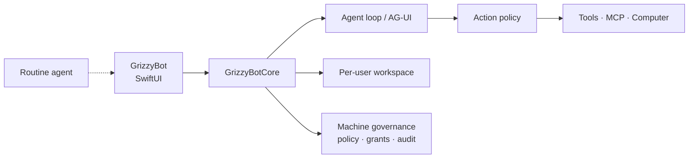

<p align="center">
  
</p>

<h1 align="center">GrizzyBot</h1>

<p align="center">
  <strong>A native macOS team of AI agents.</strong><br>
  Each bot has its own chat, files, memory, computer, routines, and tools — on this Mac.
</p>

<p align="center">
  
  
  
  
</p>

<p align="center">
  <a href="#what-you-get">Product</a> ·
  <a href="#governance">Governance</a> ·
  <a href="#computer">Computer</a> ·
  <a href="#models">Models</a> ·
  <a href="#build">Build</a> ·
  <a href="#license">License</a>
</p>

---

Connect a cloud or local model and every send runs a real tool-calling loop. Without a model, a scripted fallback still drives the UI so you can explore offline.

Requires **macOS 15+** and **Xcode 16+ / Swift 6**. Version **1.1**.

---

## What you get

<table>
<tr>
<td width="50%" valign="top">

**Workspace**
Local or named accounts. Separate files, chats, and secrets per user. Passwords are PBKDF2. Keys live in Keychain.

**Bots**
Templates for coworker, research, writing, coding, and computer use. Per-bot model, tools, skills, and home folder. Rooms, spawn, and short-lived subagents.

**Chat**
Markdown, tool cards, live step progress. Search, edit, regenerate, branch, undo. Attachments, dictation, spoken replies.

</td>
<td width="50%" valign="top">

**Computer**
This Mac (Accessibility) or a persistent in-app browser. Screenshot → target list → click / type / key. Exclusive takeover for login.

**Governance**
CEL policy, MCP grant matrix, knowledge ACLs, published components, owner/operator roles, searchable audit with a boot boundary.

**Connect**
OpenRouter, OpenAI, Anthropic, local Ollama/LM Studio, Composio plugins, MCP (stdio / HTTP / SSE), and AG-UI coworkers.

</td>
</tr>
</table>

---

## Accounts and workspaces

- Continue with a local workspace on this Mac, or sign up with email.
- Each signed-in account is a separate workspace. Bots, chats, settings, and files do not mix.
- The **first account on the Mac is owner**. Later sign-ups are operators: they get their own bots and chats; policy, grants, knowledge, and published components are shared and owner-gated.

```
~/Library/Application Support/GrizzyBot/
  users.json / session.json / governance.json / audit.json
  users/<userId>/
    workspace.json      bots, threads, routines, settings
    SHARED.md           memory every bot on this account can read
    homes/<botId>/      that bot’s private files (MEMORY.md, notes, shell cwd)
    skills/             imported SKILL.md folders
```

---

## Bots

Create from a template or from scratch.

| Template | For |
|---|---|
| Coworker | General work — files, search, memory, computer |
| Researcher | Web search, cited notes, saved briefs |
| Writer | Markdown reports, CSV tables, HTML slides |
| Coder | Read, edit, and run code in the bot home |
| Operator | Drive the in-app browser or this Mac |

Each bot has a name, instructions, enabled skills and tools, optional per-bot model, visibility (private / shared), runtime (GrizzyBot loop or **AG-UI** endpoint), and its own home folder. Spawn child bots or a short-lived subagent from chat. Rooms group several bots in one conversation.

---

## Chat

- Markdown replies, tool cards, component cards, and live “thinking… step *N*” while the agent runs.
- Search chats (⌘F), edit a send, regenerate, branch, undo send (⌘⇧Z).
- Attach files into the bot home (`inbox/`).
- Dictation, speak replies (ElevenLabs or macOS TTS), and a finish notification when a run completes.

### Agent loop

When a model is connected, each send runs a tool-calling loop (up to 48 steps) with context compaction on long threads. Screenshots attach only when the model can actually see images. Empty web searches stop instead of retrying forever. Transient 429/5xx errors retry. A **stall watchdog** (default 60s, configurable) ends a turn when the stream goes silent.

Without a model, scripted replies still create files, open the computer, and exercise the UI.

**AG-UI runtime.** Point a bot at a LangGraph, Mastra, CrewAI, or other AG-UI endpoint. GrizzyBot consumes the full event set (text, tool calls, state snapshot/delta, steps, errors). After `RUN_FINISHED`, tools execute here through policy and audit; the next POST carries tool results and state. Optional bearer token: connection secret `agui:<bot-id>`.

---

## Tools

Bots only get the tools you enable.

| Group | Tools |
|---|---|
| **Files** | `write_file`, `read_file`, `edit_file`, `move_file`, `delete_file`, `list_files` — default cwd is the bot home. Absolute paths on this Mac are allowed for reads/lists; shell writes stay sandboxed. |
| **Shell** | `shell` runs `zsh -lc` in the bot home. Needs approval unless the bot is set to auto-approve. Timeout 5–300s (default 120). |
| **Web** | `web_search` / `web_fetch`. Optional Brave Search key; otherwise DuckDuckGo + Wikipedia. |
| **Memory** | `remember`, `search_memory`, `forget`. |
| **Knowledge** | `search_knowledge` — granted folder and plugin corpora (Drive, OneDrive, Box). |
| **Computer** | `computer_open`, `computer_screenshot`, `computer_click`, `computer_scroll`, `computer_type`, `computer_key`, `request_takeover`. |
| **Team** | `spawn_bot`, `delete_bot`, `run_subagent`. |
| **UI** | `present_component` (form, gallery, activity, refusals, or a published card), `report_decline`. |
| **Plugins & skills** | `plugin_call`, `destination_write`, `read_skill`, `import_skills`, plus any MCP servers or custom tools you add. |

---

## Computer

Two real hosts — no cloud VM or Docker.

| Mode | What it is |
|---|---|
| Auto | In-app browser unless the bot is set otherwise |
| In-app browser | Persistent WKWebView, Safari-like user agent, http/https only |
| This Mac | Screenshot + Accessibility clicks on the main display |
| Off | Computer tools disabled |

Workflow: open a URL → screenshot (JPEG + a **Targets** list in the same pixel space) → click / scroll / type / key. Clicks can be right-click or double-click. Keys accept chords (`cmd+c`, `shift+enter`). If there is no screenshot yet, one is taken before the click.

**Exclusive takeover.** Login, captcha, or 2FA: the bot calls `request_takeover` and you drive. While you hold the wheel, bot computer actions are refused and audited. Headless routine ticks skip This Mac tools (no Screen Recording session).

Settings → Computer shows Accessibility and Screen Recording status with deep links to System Settings.

---

## Governance

Settings → **Governance**, **Knowledge**, and **Components**. Policy is deny-before-allow CEL. A broken deny still denies; a broken allow does not permit. Empty allow permits nothing. Dry run records refusals and still forwards.

### Action policy

Rules see the live action, not the model’s story.

```cel
contains(element.name, "Submit")
intent == "write_tool"
contains(page.host, "bank")
mcp.effect == "write"
file.extension == "env"
```

Click and key policy hit-tests the **last screenshot outline** (`element.name`, `element.role`). The model cannot rename a Submit button to evade the rule. Host and file rules apply the same way.

Shipped default is open (`allow: true`) so an existing Mac is not locked out.

### MCP grants

A bot × server matrix in Settings. Empty matrix allows every enabled MCP server. The first revoke switches that bot to an allow-list. Per-tool grants appear after `mcp_list_tools`. Read/write **effect** uses the last advertised tool list, not a vendor-name guess. Unknown and custom servers are writes.

### Knowledge

Folder corpora stay on this Mac. Plugin sources (**Google Drive**, **OneDrive**, **Box**) sync through the connected account on search, then BM25. Empty grant list means every bot; otherwise `grantedBotIds` is the ACL.

### Components

Built-in cards: **form**, **gallery**, **activity**, **refusals**. Authored cards stay drafts until you publish (JSON playground + preview). Each bot has per-card toggles. `activity` / `refusals` take `component-data:` grants once you start using that matrix.

### Roles and audit

| Role | Can |
|---|---|
| **Owner** | Save policy, stall timeout, grants, knowledge sources, and publish components |
| **Operator** | Run bots; governance is read-only |

Audit is the last **2,000** events in JSON, queryable by type, allowed/refused, and text. Secrets are recorded as character counts, never values. On session start the trail names the live boot boundary: `computer.policy_loaded` and `computer.isolation_loaded` (This Mac vs in-app browser).

---

## Skills

Skills are `SKILL.md` playbooks. Matching skills inject into the turn; others load via `read_skill`.

| Skill | Does |
|---|---|
| **research** | Search, fetch, cite, write a brief |
| **browser** | Screenshot, click, scroll, type, take over for login |
| **office-docs** | Markdown / CSV / HTML deliverables in `notes/` |
| **coding** | Read, edit, run inside the bot home |
| **memory** | Pin, remember, forget |
| **skill-creator** | Author a new `SKILL.md` |

Import a folder of `SKILL.md` files (for example `~/.agents/skills`) with `import_skills` or Settings → Skills.

---

## Memory

- **Bot** — `homes/<botId>/MEMORY.md`
- **Shared** — `SHARED.md` at the workspace root (every bot on this account)

`remember` upserts similar facts instead of duplicating. Standing rules go under `## Pin` (`pin: true` or `scope: pin`) and always load in the prompt. Recent facts go under `## Facts`. `search_memory` is BM25 over this bot plus shared — sibling bots are not leaked. Secret-shaped strings (API keys, passwords) are refused.

Edit memory in the bot panel or Settings → Shared memory.

---

## Routines

Cron jobs that send a prompt to a bot.

- Scheduler while the app is open (cap two concurrent routine runs).
- **Background routines** (signed Release): a LaunchAgent helper wakes the app with `-grizzybot-tick-routines`. If GrizzyBot is already open, the helper pings it and exits. Headless ticks wait up to 15 minutes for runs to finish.
- Menu bar lists upcoming routines and runs a specific one, not “whatever is first.”
- Due routines with no model skip honestly and still advance `nextRunAt`.

---

## Models

GrizzyBot does not pay for usage. You bring a key, a subscription, or a local server.

| Kind | Providers |
|---|---|
| **Cloud (API key)** | OpenRouter (default), OpenAI, Anthropic, Google, Mistral, Groq, DeepSeek, xAI |
| **Subscriptions** | ChatGPT Plus/Pro (OpenAI Codex), GitHub Copilot, SuperGrok / X Premium — device-code sign-in |
| **Local / LAN** | Ollama, LM Studio, vMLX, oMLX (discovery + live model list), plus any OpenAI-compatible base URL |

Each provider keeps its own profile. A bot can use the workspace default or a catalog model. Vision images are sent only to models that can take them (text-only IDs such as DeepSeek chat or Groq Llama 3 are not stuffed with screenshots).

---

## Plugins, MCP, destinations

**Plugins** — Composio Connect OAuth, or paste a token. Catalog includes Gmail, Slack, GitHub, Notion, Linear, Google Calendar / Sheets / Docs / Drive, OneDrive, HubSpot, Salesforce, Jira, Trello, Asana, Intercom, Discord, X, Stripe, Dropbox, Box, Figma, Airtable. `plugin_call` can search/list/get or write.

**MCP** — stdio, streamable HTTP, or legacy SSE. Each server is a toggleable tool (`mcp:<id>`). Homebrew is prepended on PATH for GUI-launched stdio servers. Calls go through the grant matrix and action policy.

**Custom tools** — phrase-match replies if you still have them; prefer MCP for new tools.

---

## App chrome

- Sidebar of bots, rooms, routines, plugins, skills, weekly usage.
- Settings: General, Connections, Computer, Voice, Tools, Themes, Diagnostics, **Governance**, **Knowledge**, **Components**.
- Themes: Grizzy (default), system, light, dark, and the built-in gallery.
- Menu bar extra; optional menu-bar-only (no window until you open it).
- Launch at login (signed Release; Debug/ad-hoc shows an honest status).
- Dictation + TTS (ElevenLabs key or macOS voices).
- Optional Brave Search key; optional Sentry DSN.
- Snapshots, redacted export, iCloud backup (container `iCloud.com.grizzybot.app` when team-signed), wipe workspace.

---

## Security

- API keys, Composio, Box, TTS, Sentry, OAuth, and connection tokens → **Keychain**. Workspace JSON, exports, backups, and snapshots are stripped.
- Diagnostics and Sentry events scrub keys, tokens, and home paths.
- Shell write seatbelt stays inside the bot home unless approved.
- In-app browser: http/https/about only; desktop HTML escapes filenames.
- Computer-use is local only (WKWebView or Accessibility). No remote desktop VM.
- Action policy and MCP grants run **before** the tool acts. Audit records both permits and refusals.

Crash reports: Settings → Diagnostics. Local `last-crash.txt` is always written; Sentry is optional.

---

## Architecture



| Target | Role |
|---|---|
| `GrizzyBotCore` | Domain, agent loop, Keychain, persistence, MCP, Composio, policy, audit |
| `GrizzyBot` | SwiftUI app, computer-use, TTS, Sentry |
| `GrizzyBotRoutineAgent` | LaunchAgent helper for background routine ticks |
| `GrizzyBotCoreTests` | Unit tests (Swift Testing) |
| `GrizzyBotAppTests` | Overlay golden PNGs (host launches a lightweight test path) |
| `GrizzyBotUITests` | XCUITest overlays (`-uitest-open-*`) |

`GrizzyBotApp.swift` is `@main`. Persistence is per-user under Application Support. Machine-level `governance.json` and `audit.json` sit at the global root. The Xcode project is generated from `project.yml`.

---

## Build

```bash
swift build
xcodegen generate   # after editing project.yml
open GrizzyBot.xcodeproj
```

Release app bundle:

```bash
chmod +x Scripts/make-app.sh Scripts/notarize.sh
./Scripts/make-app.sh
```

## Test

```bash
swift test
xcodebuild -project GrizzyBot.xcodeproj -scheme GrizzyBot \
  -destination 'platform=macOS,arch=arm64' test
```

Overlay golden refresh (shell `UPDATE_SNAPSHOTS` does not reach the test host). Touch a marker file, then run app tests:

```bash
touch Tests/GrizzyBotAppTests/Goldens/.refresh
xcodebuild test -project GrizzyBot.xcodeproj -scheme GrizzyBot \
  -destination 'platform=macOS,arch=arm64' -only-testing:GrizzyBotAppTests
rm Tests/GrizzyBotAppTests/Goldens/.refresh
```

Live model evals are gated on `GRIZZYBOT_LIVE_EVAL=1`.

## Sign, notarize, publish

1. Copy `Configs/Team.xcconfig.example` → `Configs/Team.xcconfig` (gitignored) with your team ID.
2. Create iCloud container `iCloud.com.grizzybot.app` — see `Configs/iCloud-setup.md`.
3. `./Scripts/make-app.sh` (or Release archive) with team config.
4. `./Scripts/notarize.sh GrizzyBot.app` — keychain profile `GrizzyBot-notary` by default.
5. Wrap in a DMG and upload to a GitHub release.

Or tag `v*` to run `.github/workflows/release.yml` (`GRIZZYBOT_DEVELOPMENT_TEAM`, `DEVELOPER_ID_APPLICATION_P12`, `DEVELOPER_ID_APPLICATION_P12_PASSWORD`, `NOTARY_KEYCHAIN_PROFILE`).

You still do Apple Developer ID, notarize credentials, the iCloud container, Accessibility / Screen Recording, and API keys yourself. Those are not in the repo.

---

## License

[MIT](LICENSE) © 2026 Ed Griswold
